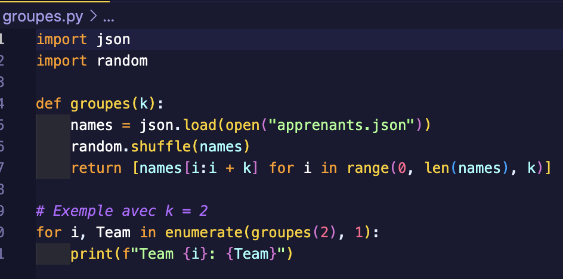

[Lien repository ](https://github.com/elhayanich/prairie_quarta)

# Fichier Json

# Code en Python :

# Code en JavaScript :

# Résultats obtenus  :

Le programme va créer des groupes de manière aléatoire en fonction de la valeur définie dans K 

**Résultats obtenus en Python si `K=2`** 

**Résultats obtenus en JavaScript si `K=5`**

