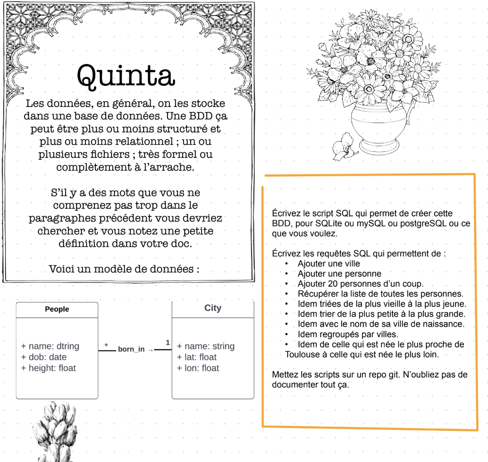
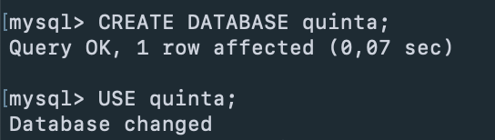
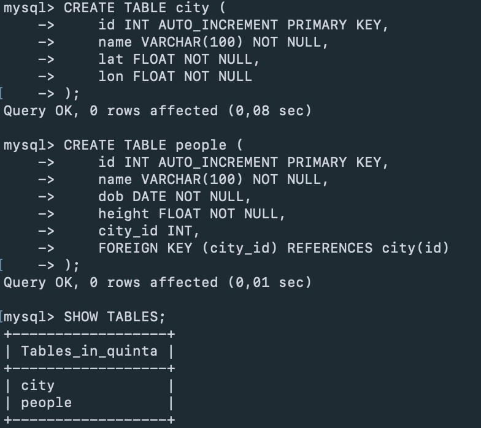
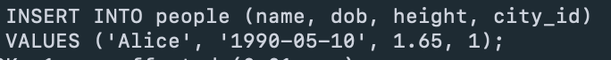
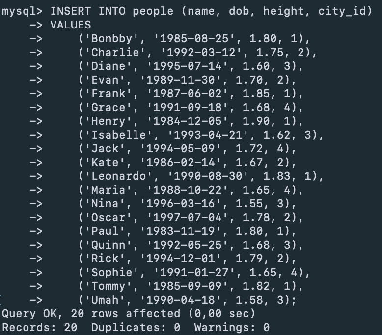
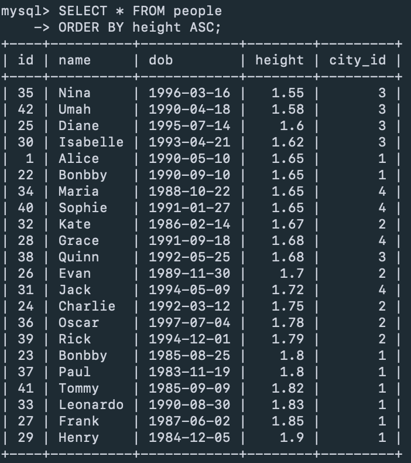
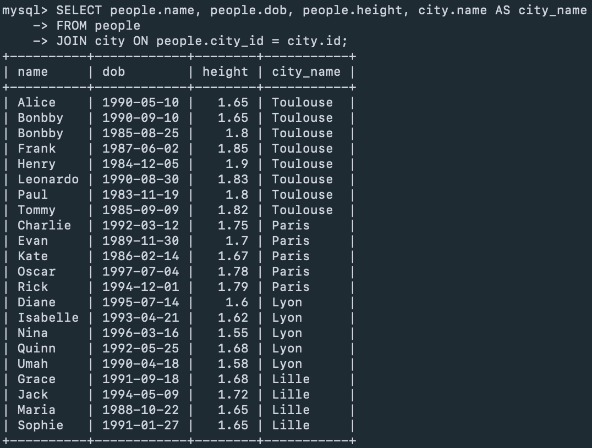
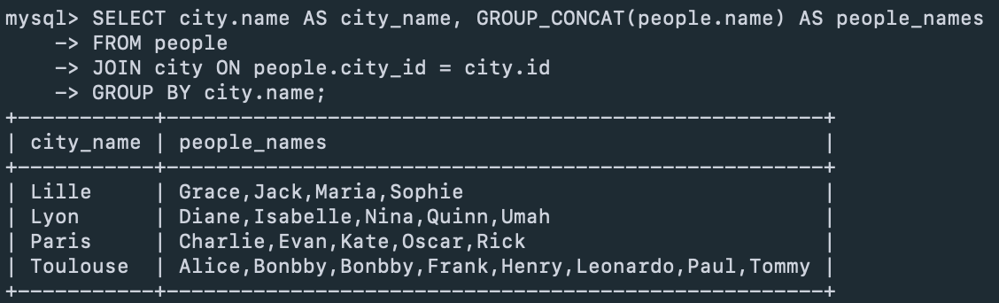

• `SQL` (Structured Query Language) est le langage standard pour interagir avec une base de données. Il est utilisé par tous les SGBD.
• Un `SGBD` est un logiciel de gestion de base de données, qui utilise donc SQL.
• `MySQL` est un SGBD très utilisé, appartenant à l'entreprise Oracle. 

**Création de la base de donnée :**

**Création des tables :** 

**Remplissage des tables avec des données :** 

**Récupérer la liste de toutes les personnes triées de la plus vieille à la plus jeune :** 

**Récupérer la liste de toutes les personnes triées de la plus petite à la plus grande :** 

**Récupérer la liste de toutes les personnes triées avec le nom de leurs villes de naissance :**

**Récupérer la liste de toutes les personnes regroupées par villes :**

**Récupérer la liste de toutes les personnes triées par celle qui est née le plus proche de Toulouse à celle qui est née le plus loin :**

