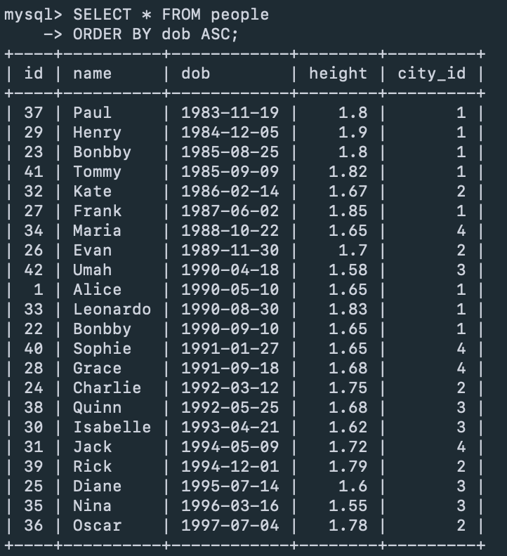

• `SQL` (Structured Query Language) est le langage standard pour interagir avec une base de données. Il est utilisé par tous les SGBD.
• Un `SGBD` est un logiciel de gestion de base de données, qui utilise donc SQL.
• `MySQL` est un SGBD très utilisé, appartenant à l'entreprise Oracle. 

**Création de la base de donnée :**

 ```mysql> CREATE DATABASE quinta; ```

  ```mysql> USE quinta; ```

**Création des tables :** 

```mysql> CREATE TABLE city (
    ->     id INT AUTO_INCREMENT PRIMARY KEY,
    ->     name VARCHAR(100) NOT NULL,
    ->     lat FLOAT NOT NULL,
    ->     lon FLOAT NOT NULL
    -> );
```

```mysql> CREATE TABLE people (
    ->     id INT AUTO_INCREMENT PRIMARY KEY,
    ->     name VARCHAR(100) NOT NULL,
    ->     dob DATE NOT NULL,
    ->     height FLOAT NOT NULL,
    ->     city_id INT,
    ->     FOREIGN KEY (city_id) REFERENCES city(id)
    -> );
``` 

**Remplissage des tables avec des données :** 


**Récupérer la liste de toutes les personnes triées de la plus vieille à la plus jeune :** 


**Récupérer la liste de toutes les personnes triées de la plus petite à la plus grande :** 


**Récupérer la liste de toutes les personnes triées avec le nom de leurs villes de naissance :**


**Récupérer la liste de toutes les personnes regroupées par villes :**

**Récupérer la liste de toutes les personnes triées par celle qui est née le plus proche de Toulouse à celle qui est née le plus loin :**

