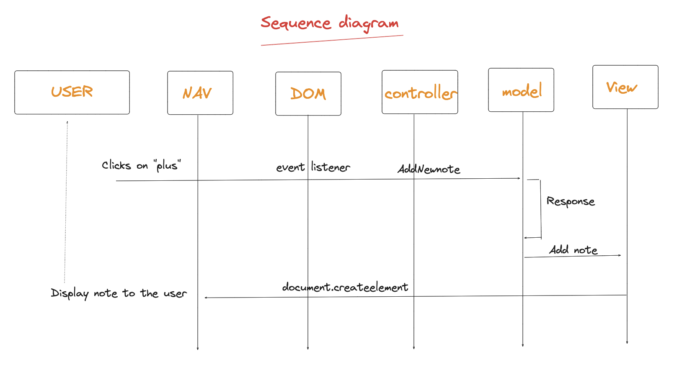

**Les cas d'utilisation :**

C'est une application de prise de note, l'utilisateur ajoute autant de notes qu'il veut, il peut éditer le contenu de la note et l'enregistrer ( validation)

**Explication du use case constaté en schéma:**

**Wireframe :**

**Le diagramme d'activité :**

**Digramme de séquence :**

**Diagramme de classe :**

**Améliorations futures :**

• Authentification

• Ajout de features : édition, suppression 

• Persistance des données

