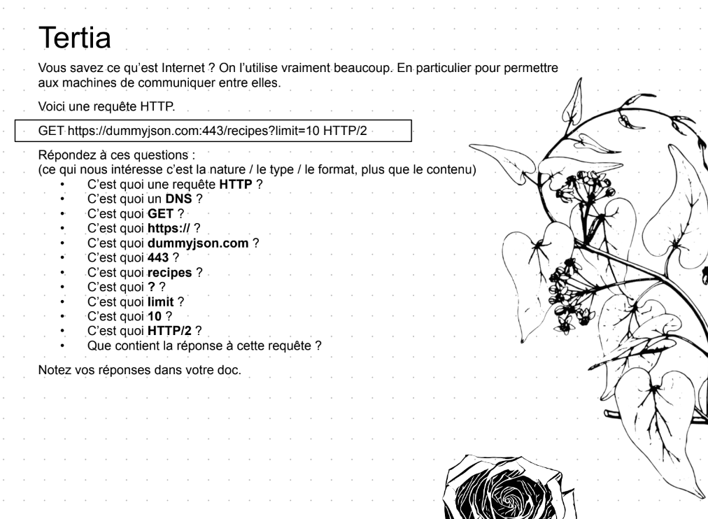

 

# Le protocole HTTP

Requête HTTP: `GET https://dummyjson.com:443/recipes?limit=10 HTTP/2`

###### • Q : C’est quoi une requête HTTP ?
• A : C'est une demande initiée par le client en utilisant le protocole http afin d'obtenir des informations ou une ressource ou encore effectuer une action spécifique. Elle contient la méthode `GET` `PUT` `POST` ...etc, le chemin de la ressource `PATH` et la version du protocole http
###### • Q : C’est quoi un DNS ?
• A : `Domain name system`, il traduit les noms de domaines en adresses IP compréhensibles par les machines. Cela permet à un utilisateur de saisir un nom de domaine convivial dans un navigateur, plutôt que d'avoir à se souvenir d'une adresse IP complexe.
###### • Q : C’est quoi GET ?
• A : c'est une méthode qui nous permet de récuperer des informations d'une API. Les méthodes definissent les types d'opérations qu'un client veut effectuer 
###### • Q : C’est quoi https:// ?
• A : le `schéma` qui spécifie le protocole utilisé : le https veut dire qu'on veut utiliser le protocole http sécrusié et le :// est un délimitateur par convention qui sépare le protocole utilisé et la suite de l'url.
###### • Q : C’est quoi dummyjson.com ?
• A : c'ets un nom de domaine; dummyjson est 
###### • Q : C’est quoi 443 ?
• A : c'est le port de connexion 
###### • Q : C’est quoi recipes ?
• A : une endpoint
###### • Q : C’est quoi ? ?
• A : début de params
###### • Q : C’est quoi limit ?
• A : le prametre
###### • Q : C’est quoi 10 ?
• A : la valeur du paramètre
###### • Q : C’est quoi HTTP/2 ?
• A : La version du protocole HTTP
###### • Q : Que contient la réponse à cette requête ?
• A : bad request erreur 400, si on enlève le HTTP/2, ça nous renvoie une api avec un objet qui contient lui meme un tableau avec 10 objets
